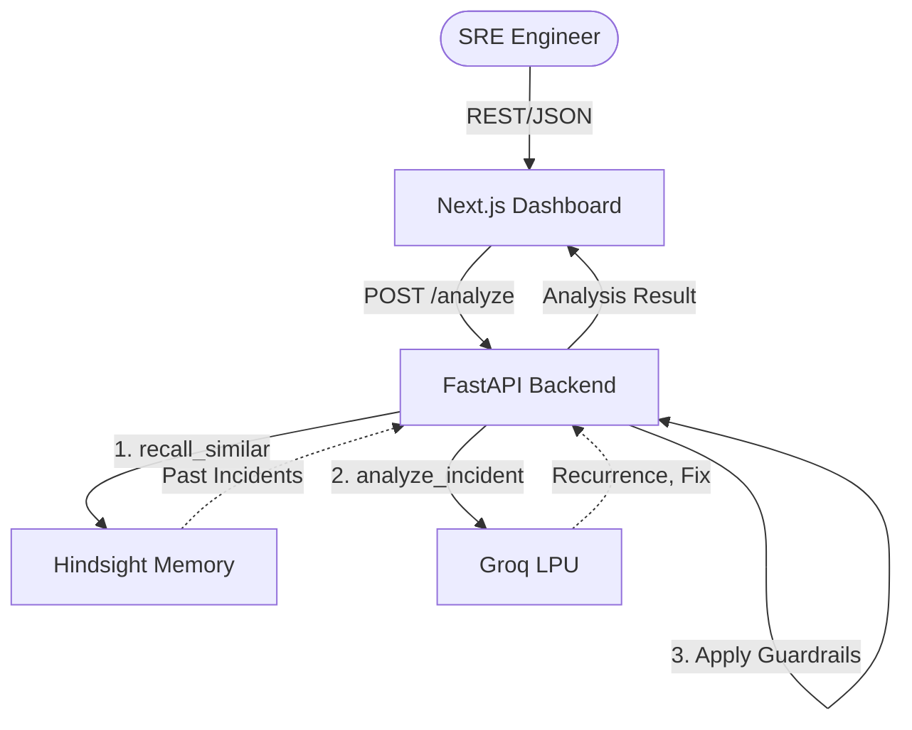

# RecallOps

**Incident-intelligence AI agent with persistent memory for SRE and DevOps teams.**

RecallOps remembers what failed last time and never recommends it again. By coupling Hindsight's long-term memory with Groq's fast LLM reasoning, it analyzes production incidents, detects recurrence, and suggests the next diagnostic action while strictly avoiding approaches that failed in the past. It gets better with every recorded outcome.

## Why it's different

| Feature | Description |
|---|---|
| **Grounded History** | Recommendations are based on actual recorded outcomes, not LLM hallucinations. |
| **ID Verification** | Cites specific incident IDs (e.g. INC-001) for transparency. |
| **Safety Guardrails** | Deterministic token-matching intercepts and blocks the LLM from suggesting previously failed actions. |
| **Degraded Mode** | If the LLM goes down, analysis continues using deterministic extraction from same-service memory. |
| **Real Learning Loop** | Explicitly records the outcome of what you *actually* tried, closing the loop. |
| **Hindsight Visibility** | Makes memory states, confidence scores, and reasoning fully visible. |

## Architecture



## Quickstart

```bash
# 1. Setup backend
cd backend
python -m venv .venv
source .venv/bin/activate  # or .venv\Scripts\activate on Windows
pip install -r requirements.txt
cp .env.example .env  # Add your GROQ_API_KEY and HINDSIGHT_API_KEY
uvicorn main:app --reload

# 2. Setup frontend
cd frontend
npm ci
npm run dev
```

## Verification

Run the test suite and evaluation harness:

```bash
# Run unit tests
cd backend
pytest tests/ -q

# Run the adversarial evaluation harness
python scripts/eval.py --adversarial
python scripts/eval.py --live
```

## Honest Limitations
- **Local Fallback**: The local JSON mirror (`backend/data/incidents.json`) provides resilience but is not durable on ephemeral hosts (e.g. serverless functions). It is meant as a cache/fallback for Hindsight.
- **Matching Heuristics**: The safety guardrail uses token stemming and substring matching. While robust to phrasing (e.g. "restarted pods" vs "restart application pods"), it does not deeply understand semantic equivalence of entirely different words.